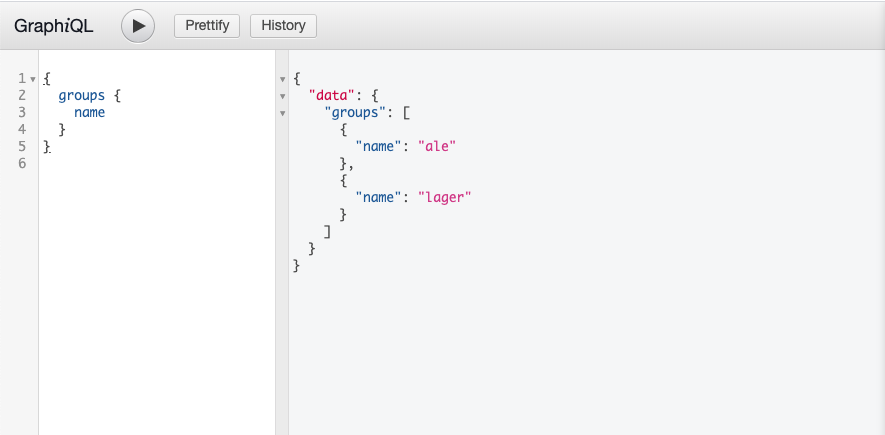
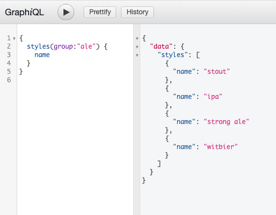
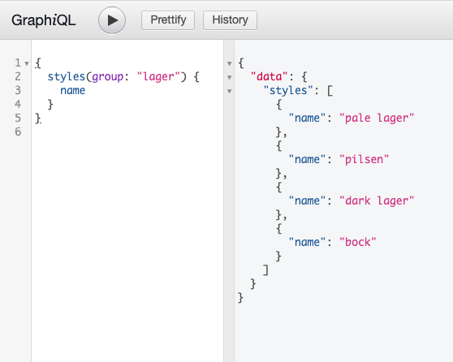

## Beer Server
This project is a server little beer styles guide. 

This project was bootstrapped with [Create React App](https://github.com/facebookincubator/create-react-app).

## Setup on Terminal and Run Project Locally
```terminal
node index.js
```

## Technologies Used
* [NodeJs](https://nodejs.org/en/)
* [Mongoose](https://mongoosejs.com/)
* [Koa](https://koajs.com/)
* [GraphQL](https://graphql.org/)

## Demo





## License

The code in this project is licensed under the MIT License. See [LICENSE](LICENSE) for details.

Note that you will be responsible for following terms of service of the third party APIs used in the code. 


